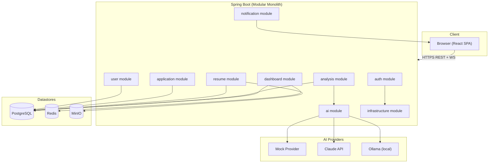
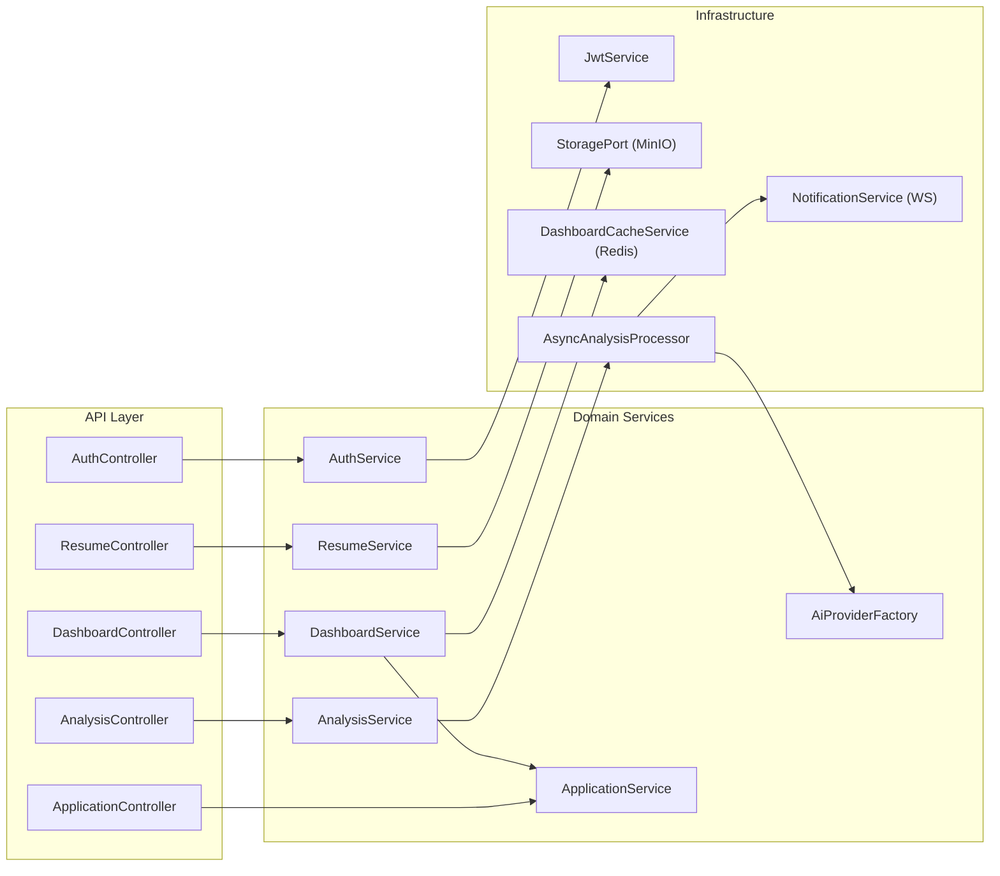
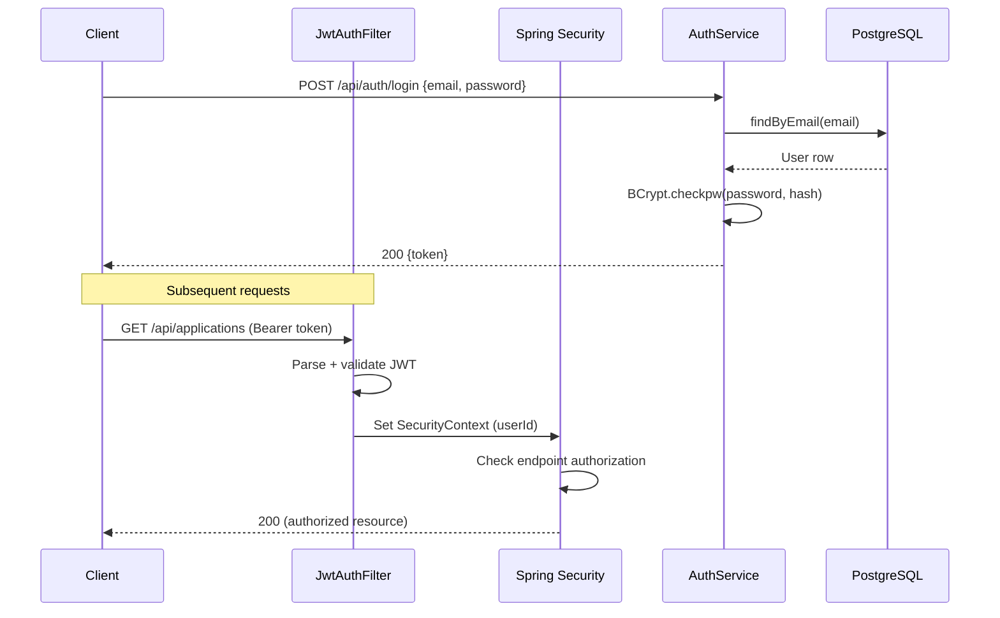
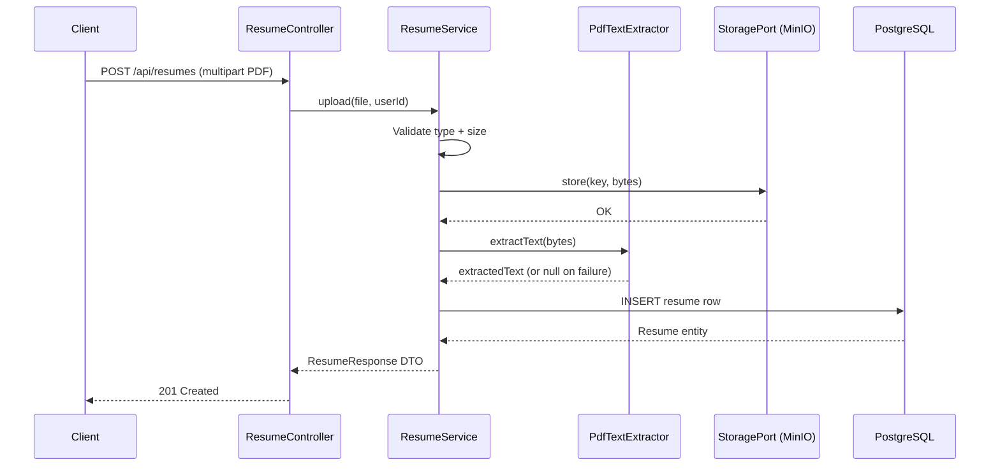
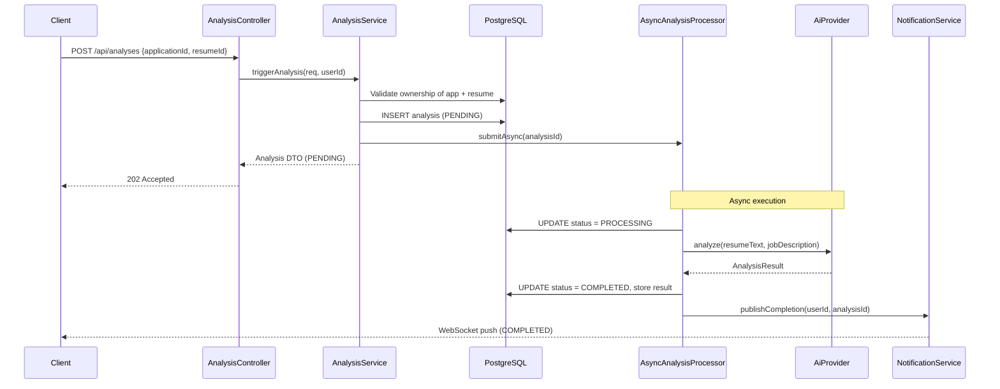
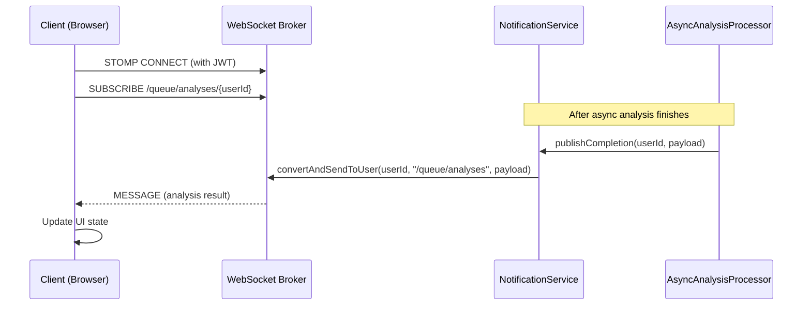
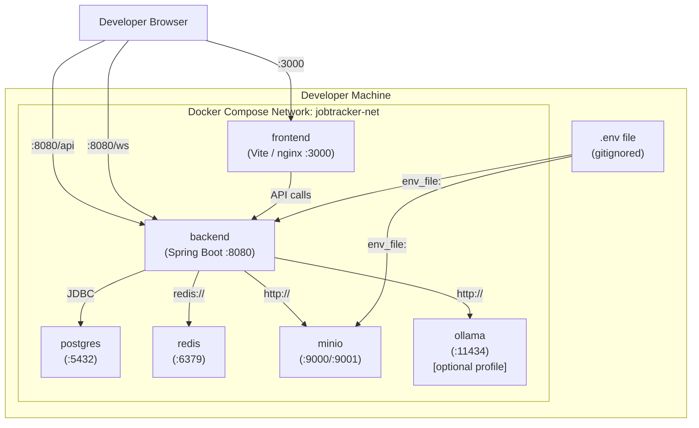

# AI-Powered Job Application Tracker — Architecture Contract

> **Stage 0 — Architecture Contract**
> This document is the authoritative reference for every subsequent implementation stage.
> Code that contradicts this document requires an explicit, recorded decision to deviate.

---

## Table of Contents

1. [Project Goals and Scope](#1-project-goals-and-scope)
2. [Non-Goals](#2-non-goals)
3. [Technology Responsibility Map](#3-technology-responsibility-map)
4. [Modular Monolith Structure](#4-modular-monolith-structure)
5. [Backend Package Hierarchy](#5-backend-package-hierarchy)
6. [Frontend Structure](#6-frontend-structure)
7. [Module Dependency Rules](#7-module-dependency-rules)
8. [Domain Entities and Relationships](#8-domain-entities-and-relationships)
9. [Data Ownership](#9-data-ownership)
10. [Authentication and Authorization Flow](#10-authentication-and-authorization-flow)
11. [Resume Upload Flow](#11-resume-upload-flow)
12. [AI Analysis Flow](#12-ai-analysis-flow)
13. [Async Processing Flow](#13-async-processing-flow)
14. [WebSocket Notification Flow](#14-websocket-notification-flow)
15. [Redis Caching Strategy](#15-redis-caching-strategy)
16. [MinIO Storage Strategy](#16-minio-storage-strategy)
17. [Docker Compose Architecture](#17-docker-compose-architecture)
18. [Testing Strategy](#18-testing-strategy)
19. [Configuration Strategy](#19-configuration-strategy)
20. [Error-Handling Approach](#20-error-handling-approach)
21. [Security Considerations](#21-security-considerations)
22. [Feature-to-Technology Matrix](#22-feature-to-technology-matrix)
23. [Recommended Implementation Order](#23-recommended-implementation-order)
24. [Diagrams](#24-diagrams)

---

## 1. Project Goals and Scope

**Primary goal:** Demonstrate production-quality full-stack engineering through a realistic,
interview-relevant portfolio project.

**Functional scope (MVP):**

- User accounts with secure registration and login
- Personal job application pipeline with status tracking
- Resume PDF upload, storage, and text extraction
- AI-assisted resume-versus-job-description analysis
- Asynchronous analysis processing with real-time completion notifications
- Dashboard with cached aggregate statistics
- React frontend covering the full user journey

**Portfolio goals:**

- Showcase Java / Spring Boot backend architecture
- Demonstrate security thinking (JWT, ownership enforcement, input validation)
- Show practical AI integration with graceful fallback
- Illustrate async patterns and WebSocket usage
- Present a working Docker Compose development environment

---

## 2. Non-Goals

The following are explicitly out of scope for the current build:

| Out of scope | Reason |
|---|---|
| Microservices | Unnecessary complexity for this scale |
| Kafka / RabbitMQ | Spring `@Async` is sufficient for the async requirement |
| Kubernetes | Docker Compose is the target deployment |
| CQRS / Event sourcing | Adds complexity with no benefit here |
| Multi-tenant SaaS isolation | Single-user-per-account model is sufficient |
| Payment or subscription handling | Not a product |
| Email delivery | Out of scope; WebSocket is the notification channel |
| CV / cover letter generation | AI analysis only; generation is a future item |
| Mobile native applications | Responsive web only |
| Production deployment pipeline | Docker Compose for local/demo; CI is a stretch goal |
| Full-text search | Not required by the spec |
| Audit logging to external SIEM | Spring Boot Actuator is sufficient |

---

## 3. Technology Responsibility Map

| Technology | Responsibility |
|---|---|
| **Java 21** | Application language; virtual threads available if needed |
| **Spring Boot 3** | Application framework, auto-configuration, lifecycle |
| **Spring Security** | Authentication filter chain, endpoint protection |
| **JWT (jjwt / nimbus)** | Stateless auth tokens — issued on login, validated on every request |
| **BCrypt** | Password hashing at registration; comparison at login |
| **Spring Data JPA / Hibernate** | ORM, repository abstraction, lazy-loading control |
| **PostgreSQL** | Primary persistent store for all business data |
| **Flyway** | Versioned, repeatable database schema migrations |
| **Redis** | Short-lived dashboard statistics cache; TTL-based invalidation |
| **MinIO** | Object storage for resume PDF files |
| **Spring AI** | Abstraction over LLM providers (Claude, Ollama) |
| **Apache PDFBox** | Server-side PDF text extraction |
| **Spring WebSocket + STOMP** | Push notifications for async analysis completion |
| **Swagger / OpenAPI (springdoc)** | Auto-generated, interactive API documentation |
| **Spring Boot Actuator** | Health, metrics, info endpoints |
| **Maven** | Build, dependency management, multi-module if desired |
| **React 18** | Single-page application, component rendering |
| **Vite** | Frontend build tool, dev server with HMR |
| **React Router** | Client-side routing |
| **Docker Compose** | Local development orchestration |

---

## 4. Modular Monolith Structure

The backend is a **single deployable JAR** divided into cohesive modules by package.
Each module owns its own domain logic, persistence, and API surface.
Modules communicate through well-defined Java interfaces — never by reaching into each
other's repositories or JPA entities directly.

### Modules

| Module | Responsibility |
|---|---|
| `auth` | Registration, login, JWT issuance, token validation |
| `user` | User profile, settings, authenticated-user context |
| `application` | Job application CRUD, status transitions, ownership |
| `resume` | PDF upload, MinIO storage, PDFBox extraction, metadata |
| `ai` | AI provider abstraction, provider selection, request/response types |
| `analysis` | Analysis lifecycle, persistence, result storage |
| `notification` | WebSocket/STOMP configuration and message publishing |
| `dashboard` | Aggregate statistics, Redis cache integration |
| `infrastructure` | Cross-cutting: Flyway config, MinIO client, Redis client, error handling, security config |

---

## 5. Backend Package Hierarchy

```
com.jobtracker
├── auth
│   ├── api
│   │   ├── AuthController.java
│   │   ├── LoginRequest.java
│   │   ├── LoginResponse.java
│   │   ├── RegisterRequest.java
│   │   └── RegisterResponse.java
│   ├── domain
│   │   └── AuthService.java
│   └── infrastructure
│       ├── JwtService.java
│       └── JwtAuthenticationFilter.java
│
├── user
│   ├── api
│   │   ├── UserController.java
│   │   └── UserProfileResponse.java
│   ├── domain
│   │   ├── User.java                  (JPA entity)
│   │   ├── UserService.java
│   │   └── UserRepository.java
│   └── infrastructure
│       └── (none currently)
│
├── application
│   ├── api
│   │   ├── ApplicationController.java
│   │   ├── CreateApplicationRequest.java
│   │   ├── UpdateApplicationRequest.java
│   │   └── ApplicationResponse.java
│   ├── domain
│   │   ├── JobApplication.java        (JPA entity)
│   │   ├── ApplicationStatus.java     (enum)
│   │   ├── ApplicationService.java
│   │   └── ApplicationRepository.java
│   └── infrastructure
│       └── (none currently)
│
├── resume
│   ├── api
│   │   ├── ResumeController.java
│   │   └── ResumeResponse.java
│   ├── domain
│   │   ├── Resume.java                (JPA entity)
│   │   ├── ResumeService.java
│   │   └── ResumeRepository.java
│   └── infrastructure
│       ├── MinioStorageService.java
│       ├── PdfTextExtractor.java
│       └── StoragePort.java           (interface)
│
├── ai
│   ├── api
│   │   └── (internal only; no direct HTTP endpoint)
│   ├── domain
│   │   ├── AiProvider.java            (interface)
│   │   ├── AnalysisRequest.java
│   │   ├── AnalysisResult.java
│   │   └── AiProviderFactory.java
│   └── infrastructure
│       ├── MockAiProvider.java
│       ├── ClaudeAiProvider.java
│       └── OllamaAiProvider.java
│
├── analysis
│   ├── api
│   │   ├── AnalysisController.java
│   │   ├── TriggerAnalysisRequest.java
│   │   └── AnalysisResponse.java
│   ├── domain
│   │   ├── Analysis.java              (JPA entity)
│   │   ├── AnalysisStatus.java        (enum)
│   │   ├── AnalysisService.java
│   │   └── AnalysisRepository.java
│   └── infrastructure
│       └── AsyncAnalysisProcessor.java
│
├── notification
│   ├── domain
│   │   └── NotificationService.java
│   └── infrastructure
│       └── WebSocketConfig.java
│
├── dashboard
│   ├── api
│   │   ├── DashboardController.java
│   │   └── DashboardStatsResponse.java
│   ├── domain
│   │   └── DashboardService.java
│   └── infrastructure
│       └── DashboardCacheService.java
│
└── infrastructure
    ├── config
    │   ├── SecurityConfig.java
    │   ├── RedisConfig.java
    │   ├── MinioConfig.java
    │   ├── AsyncConfig.java
    │   └── OpenApiConfig.java
    ├── exception
    │   ├── GlobalExceptionHandler.java
    │   ├── ResourceNotFoundException.java
    │   ├── AccessDeniedException.java
    │   └── ValidationException.java
    └── web
        └── CurrentUserArgumentResolver.java
```

---

## 6. Frontend Structure

```
frontend/
├── public/
├── src/
│   ├── api/
│   │   ├── client.ts          # Axios instance, auth header injection, 401 handling
│   │   ├── auth.ts
│   │   ├── applications.ts
│   │   ├── resumes.ts
│   │   ├── analysis.ts
│   │   └── dashboard.ts
│   ├── components/
│   │   ├── common/            # Buttons, inputs, error/loading states, layout shell
│   │   └── features/          # Feature-specific components
│   ├── hooks/
│   │   ├── useAuth.ts
│   │   └── useWebSocket.ts
│   ├── pages/
│   │   ├── LoginPage.tsx
│   │   ├── RegisterPage.tsx
│   │   ├── DashboardPage.tsx
│   │   ├── ApplicationsPage.tsx
│   │   ├── ApplicationDetailPage.tsx
│   │   ├── ResumesPage.tsx
│   │   └── ProfilePage.tsx
│   ├── router/
│   │   └── AppRouter.tsx      # React Router config, protected route wrapper
│   ├── store/
│   │   └── authStore.ts       # Lightweight auth state (token + user); no Redux
│   ├── types/
│   │   └── index.ts           # Shared TypeScript types
│   ├── App.tsx
│   └── main.tsx
├── index.html
├── vite.config.ts
├── tsconfig.json
└── package.json
```

### Frontend routing

| Route | Component | Auth required |
|---|---|---|
| `/login` | LoginPage | No |
| `/register` | RegisterPage | No |
| `/dashboard` | DashboardPage | Yes |
| `/applications` | ApplicationsPage | Yes |
| `/applications/:id` | ApplicationDetailPage | Yes |
| `/resumes` | ResumesPage | Yes |
| `/profile` | ProfilePage | Yes |

---

## 7. Module Dependency Rules

### Allowed dependencies

```
Controllers (api/) --> Application services (domain/)
Application services --> Domain logic, Repositories, Ports (interfaces)
Infrastructure classes --> Implement Ports / extend Spring abstractions
```

### Prohibited cross-module dependencies

| Forbidden | Reason |
|---|---|
| `analysis` reaching into `resume.domain.ResumeRepository` directly | Must go through `ResumeService` |
| `dashboard` querying `ApplicationRepository` directly | Must go through `ApplicationService` |
| `ai` module importing Spring Security classes | No security logic in AI module |
| Any module importing from `infrastructure.config` | Config beans are injected, not imported |
| JPA entities leaking into API response DTOs | Always map to response DTOs |

### Inter-module communication

Modules call each other's **service interfaces**, never repositories.
Where an operation crosses module boundaries frequently, extract a dedicated port interface.

---

## 8. Domain Entities and Relationships

### Entity summary

| Entity | Table | Key fields |
|---|---|---|
| `User` | `users` | id, email, password_hash, created_at, updated_at |
| `JobApplication` | `job_applications` | id, user_id, company, role, status, job_description, notes, applied_at, created_at, updated_at |
| `Resume` | `resumes` | id, user_id, original_filename, storage_key, extracted_text, file_size_bytes, created_at |
| `Analysis` | `analyses` | id, user_id, application_id, resume_id, status, match_score, result_json, error_message, created_at, completed_at |

### Application statuses

```
WISHLIST -> APPLIED -> SCREENING -> INTERVIEW -> OFFER
                                              -> REJECTED
                    -> REJECTED
         -> WITHDRAWN (from any active state)
```

### Analysis statuses

```
PENDING -> PROCESSING -> COMPLETED
                      -> FAILED
```

### Entity relationships

```
User 1──* JobApplication
User 1──* Resume
User 1──* Analysis
JobApplication 1──* Analysis
Resume 1──* Analysis
```

---

## 9. Data Ownership

Every row in every business table carries a `user_id` foreign key.

**Ownership enforcement rules:**

1. The authenticated user's ID is extracted from the validated JWT — never from the request body or URL parameter.
2. Every read, update, and delete operation verifies `user_id = currentUser.id` before returning data.
3. A request for a resource belonging to another user returns `404 Not Found`, not `403 Forbidden`, to avoid confirming resource existence.
4. Service methods accept a `Long userId` parameter explicitly. Controllers never pass raw entity objects across modules.

---

## 10. Authentication and Authorization Flow

### Registration

1. POST `/api/auth/register` with `{email, password}`
2. Validate email format and password strength
3. Check email uniqueness (throw `409 Conflict` if taken)
4. Hash password with BCrypt (strength 12)
5. Persist `User`
6. Return `201 Created` with user profile (no token — require explicit login)

### Login

1. POST `/api/auth/login` with `{email, password}`
2. Load user by email; return `401` on not found
3. Compare password with BCrypt; return `401` on mismatch
4. Issue signed JWT (HS256 or RS256) with claims: `sub=userId`, `email`, `iat`, `exp`
5. Return token in response body (not in a cookie, for simplicity)

### Request authentication

1. `JwtAuthenticationFilter` intercepts every request
2. Extracts `Bearer <token>` from `Authorization` header
3. Validates signature, expiry, and subject
4. Loads `UserDetails` and sets `SecurityContextHolder`
5. Unauthenticated requests to protected endpoints receive `401`

### Token details

| Setting | Value |
|---|---|
| Algorithm | HS256 (secret from env) |
| Expiry | 24 hours (configurable) |
| Refresh | Not implemented in MVP; re-login required |
| Storage (client) | localStorage (acceptable for portfolio; note XSS risk in docs) |

---

## 11. Resume Upload Flow

1. Client: POST `/api/resumes` with `multipart/form-data` containing the PDF file
2. Backend validates:
   - Content-Type is `application/pdf`
   - File size is within limit (default: 10 MB)
   - File is not empty
3. Generate a unique storage key: `resumes/{userId}/{uuid}.pdf`
4. Upload raw bytes to MinIO bucket via `StoragePort`
5. Extract text using Apache PDFBox (synchronously at upload time)
6. Persist `Resume` entity with storage key, original filename, extracted text, file size
7. Return `201 Created` with `ResumeResponse` DTO (no extracted text in response by default)

**Failure handling:**

| Failure | Response |
|---|---|
| Wrong file type | `400 Bad Request` |
| File too large | `413 Payload Too Large` |
| PDFBox extraction fails | Store resume with `extracted_text = null`; log warning; do not fail the upload |
| MinIO unavailable | `503 Service Unavailable` |

---

## 12. AI Analysis Flow

1. Client: POST `/api/analyses` with `{applicationId, resumeId}`
2. Validate ownership of both application and resume
3. Load job description from `JobApplication.jobDescription`
4. Load extracted text from `Resume.extractedText`
5. Validate neither is blank (return `422` if missing)
6. Create `Analysis` entity with status `PENDING`; persist and return `202 Accepted` with analysis ID
7. Submit async task (see Section 13)

### Analysis result structure

```json
{
  "matchScore": 78,
  "matchingSkills": ["Java", "Spring Boot", "REST APIs"],
  "missingSkills": ["Kubernetes", "Go"],
  "strengths": ["Strong backend foundation", "Database experience"],
  "recommendations": ["Add cloud deployment section", "Mention CI/CD tools"],
  "summary": "Strong candidate for backend roles; some cloud gaps."
}
```

---

## 13. Async Processing Flow

1. `AnalysisService.triggerAnalysis()` submits a task to Spring's `@Async` executor
2. `AsyncAnalysisProcessor.process(analysisId)`:
   a. Load `Analysis` from DB; update status to `PROCESSING`
   b. Retrieve `AiProvider` from `AiProviderFactory` (based on configured provider)
   c. Build `AnalysisRequest{resumeText, jobDescription}`
   d. Call `aiProvider.analyze(request)` — returns `AnalysisResult`
   e. On success: update `Analysis` with results, status `COMPLETED`, `completedAt`
   f. On exception: update status to `FAILED`, store sanitized error message
   g. Publish WebSocket notification in both cases
3. HTTP request returns `202 Accepted` immediately after step 1 completes

**Thread pool configuration:**

| Setting | Default value |
|---|---|
| Core pool size | 4 |
| Max pool size | 8 |
| Queue capacity | 100 |
| Thread name prefix | `analysis-async-` |

---

## 14. WebSocket Notification Flow

### Configuration

- Endpoint: `/ws` (SockJS fallback enabled)
- Application destination prefix: `/app`
- Broker destinations: `/topic`, `/queue`

### Topic design

User-specific notifications use per-user queues:

```
/queue/analyses/{userId}
```

The backend publishes to this destination after analysis completion or failure.
The client subscribes on login and processes incoming messages to update the UI.

### Message payload

```json
{
  "analysisId": 42,
  "applicationId": 7,
  "status": "COMPLETED",
  "matchScore": 78,
  "message": "Analysis complete"
}
```

### Security

WebSocket connections require a valid JWT, passed as a query parameter
or in the STOMP `CONNECT` frame headers (implementation decision to be finalized in Stage 8).

---

## 15. Redis Caching Strategy

### What is cached

Only dashboard statistics are cached. All other reads go directly to PostgreSQL.

### Cache key scheme

```
dashboard:stats:{userId}
```

### TTL

5 minutes (configurable via `app.cache.dashboard-ttl-seconds`).

### Invalidation triggers

Cache entries for `userId` are evicted on any write to `job_applications` for that user:
- Create application
- Update application (including status change)
- Delete application

### Fallback behavior

If Redis is unavailable, the application **falls back to querying PostgreSQL directly**.
A warning is logged. The response is not cached. No exception is propagated to the client.

### User isolation

Cache keys always include `userId`. Cross-user cache reads are structurally impossible
with this key scheme.

---

## 16. MinIO Storage Strategy

### Bucket structure

| Bucket | Content |
|---|---|
| `resumes` | User-uploaded PDF files |

### Object key format

```
{userId}/{uuid}.pdf
```

The `userId` prefix enables per-user prefix-based listing if needed.
The `uuid` ensures uniqueness and prevents filename collisions.

### Access control

- The MinIO bucket is **private** (no public read policy).
- Files are served by the backend only; the backend generates short-lived presigned URLs or streams bytes directly (decision: stream directly for MVP simplicity).
- The client never receives MinIO credentials.

### Cleanup

Resume deletion removes the object from MinIO and the metadata row from PostgreSQL
within the same service call. Partial failure (MinIO deleted but DB row not removed, or vice versa)
is logged; a compensating background task is a future improvement.

---

## 17. Docker Compose Architecture

### Services

| Service | Image | Purpose |
|---|---|---|
| `postgres` | `postgres:16` | Primary database |
| `redis` | `redis:7-alpine` | Dashboard cache |
| `minio` | `minio/minio` | Object storage |
| `backend` | Built from `./backend` Dockerfile | Spring Boot application |
| `frontend` | Built from `./frontend` Dockerfile | Vite dev server (or nginx in prod mode) |
| `ollama` | `ollama/ollama` (optional profile) | Local LLM serving |

### Networking

All services share a single Docker bridge network (`jobtracker-net`).
Services reference each other by service name (e.g., `postgres`, `redis`, `minio`).

### Persistence

Named volumes for PostgreSQL data and MinIO data ensure data survives container restarts.

### Environment

All secrets and environment-specific values are supplied via `.env` (gitignored).
`.env.example` is committed and documents every required variable.

### Profiles

The `ollama` service is behind a `--profile ollama` flag so it is not started by default.

---

## 18. Testing Strategy

### Unit tests

- Domain service logic tested in isolation with Mockito mocks
- AI provider response parsing tested with canned responses
- JWT generation and validation tested without Spring context
- PDF extraction logic tested with sample PDF bytes

### Integration tests

- Spring Boot `@SpringBootTest` tests against Testcontainers-managed PostgreSQL and Redis
- MinIO tested against a Testcontainers MinIO instance
- API-layer tests (`@AutoConfigureMockMvc`) for auth, CRUD, and ownership enforcement
- All AI provider integration tests default to the Mock provider
- WebSocket tests in Stage 8

### Test rules

- Tests must pass before a stage is considered complete
- No `@Disabled` tests without a documented reason
- Testcontainers images are pinned to specific versions for reproducibility
- The test suite must run without any external service (use Mock AI, Testcontainers for DB/Redis/MinIO)
- Never test with production credentials

### Coverage targets (guidance, not hard gates)

| Area | Target |
|---|---|
| Service layer | >80% line coverage |
| Security / auth | All happy and error paths covered |
| Ownership enforcement | Explicit cross-user tests for every resource type |

---

## 19. Configuration Strategy

### Principle

All environment-specific and secret values come from environment variables.
Application defaults are defined in `application.yml`.
Environment overrides are loaded via Spring's standard property resolution.

### Key configuration variables

| Variable | Purpose |
|---|---|
| `DB_URL` | PostgreSQL JDBC URL |
| `DB_USERNAME` | PostgreSQL username |
| `DB_PASSWORD` | PostgreSQL password |
| `REDIS_HOST` | Redis hostname |
| `REDIS_PORT` | Redis port |
| `MINIO_ENDPOINT` | MinIO server URL |
| `MINIO_ACCESS_KEY` | MinIO access key |
| `MINIO_SECRET_KEY` | MinIO secret key |
| `MINIO_BUCKET` | MinIO bucket name |
| `JWT_SECRET` | HMAC signing secret (min 256 bits) |
| `JWT_EXPIRATION_MS` | Token TTL in milliseconds |
| `AI_PROVIDER` | `mock`, `claude`, or `ollama` |
| `ANTHROPIC_API_KEY` | Claude API key (only needed when `AI_PROVIDER=claude`) |
| `OLLAMA_BASE_URL` | Ollama server URL (only needed when `AI_PROVIDER=ollama`) |
| `OLLAMA_MODEL` | Ollama model name |

### Profiles

| Profile | Purpose |
|---|---|
| `default` | Local development |
| `test` | Activated automatically during `mvn test` |
| `docker` | Overrides for Docker Compose; service names replace localhost |

---

## 20. Error-Handling Approach

A single `GlobalExceptionHandler` (`@RestControllerAdvice`) translates all exceptions
to structured JSON error responses.

### Error response shape

```json
{
  "timestamp": "2025-09-01T12:00:00Z",
  "status": 404,
  "error": "Not Found",
  "message": "Application not found",
  "path": "/api/applications/99"
}
```

### Exception-to-status mapping

| Exception | HTTP status |
|---|---|
| `ResourceNotFoundException` | 404 |
| `AccessDeniedException` | 404 (hides existence) |
| `ValidationException` | 400 |
| `MethodArgumentNotValidException` | 400 (field errors included) |
| `DataIntegrityViolationException` (duplicate email) | 409 |
| `FileSizeLimitExceededException` | 413 |
| `UnsupportedFileTypeException` | 400 |
| `ServiceUnavailableException` (MinIO/Redis down) | 503 |
| `Exception` (catch-all) | 500 — log full stack trace; return generic message |

### Logging rules

- Log at `WARN` for expected client errors (4xx)
- Log at `ERROR` for unexpected server errors (5xx) with full stack trace
- Never log passwords, JWT secrets, or full PDF content

---

## 21. Security Considerations

| Concern | Mitigation |
|---|---|
| Password storage | BCrypt (strength 12) — plaintext never stored or logged |
| JWT secret | Minimum 256-bit random secret from environment; never in source |
| JWT expiry | 24 hours; no refresh token in MVP |
| Ownership | Every resource query filters by `userId` from JWT — client-supplied IDs are never trusted |
| Resource existence leakage | 404 returned for both "not found" and "not yours" |
| SQL injection | JPA / parameterized queries only; no raw string concatenation |
| XSS (API) | JSON responses; `Content-Type: application/json` enforced |
| File upload | Content-Type and magic-byte validation; size limit; storage key generated server-side |
| CORS | Restricted to known frontend origin in production config |
| Actuator | Health endpoint public; all other actuator endpoints require authentication |
| Secrets in source | `.env` gitignored; `.env.example` contains only placeholder values |
| Dependency vulnerabilities | `mvn dependency:analyze` and OWASP dependency-check recommended (future CI step) |

---

## 22. Feature-to-Technology Matrix

| Feature | Technologies |
|---|---|
| User registration / login | Spring Security, BCrypt, JWT, PostgreSQL |
| Protected endpoints | Spring Security filter chain, JWT validation |
| Job application CRUD | Spring MVC, Spring Data JPA, PostgreSQL, Flyway |
| Status tracking | Enum column in PostgreSQL, service-layer transitions |
| Resume upload | Spring MVC multipart, MinIO, PDFBox |
| PDF text extraction | Apache PDFBox |
| File storage | MinIO (StoragePort abstraction) |
| AI analysis (Mock) | `MockAiProvider`, hardcoded deterministic response |
| AI analysis (Claude) | Spring AI, Anthropic Claude API |
| AI analysis (Ollama) | Spring AI, Ollama local server |
| Async analysis processing | Spring `@Async`, `ThreadPoolTaskExecutor` |
| Analysis status persistence | PostgreSQL, JPA |
| Real-time notifications | Spring WebSocket, STOMP, SockJS |
| Dashboard statistics | PostgreSQL aggregates, Redis cache |
| API documentation | springdoc-openapi (Swagger UI) |
| Health / metrics | Spring Boot Actuator |
| Frontend routing | React Router 6 |
| Frontend auth state | localStorage token + React context |
| Local infrastructure | Docker Compose |

---

## 23. Recommended Implementation Order

| Stage | Deliverable |
|---|---|
| 0 | Architecture Contract (this document) |
| 1 | Project skeleton: Spring Boot + React/Vite + Docker Compose + PostgreSQL connection |
| 2 | Domain model, Flyway migrations, JPA entities, CRUD API (no auth yet) |
| 3 | Spring Security, JWT auth, BCrypt, ownership enforcement |
| 4 | React frontend: login, register, applications CRUD, dashboard shell |
| 5 | MinIO integration, resume upload, PDFBox extraction |
| 6 | AI abstraction, Mock provider, analysis endpoint |
| 7 | Spring AI, Claude provider, Ollama provider, provider selection |
| 8 | Async analysis processing, WebSocket/STOMP notifications |
| 9 | Redis dashboard caching, cache invalidation, fallback |
| 10 | Testing pass, hardening, final README |

---

## 24. Diagrams

All diagrams use [Mermaid](https://mermaid.js.org/) syntax.

---

### 24.1 System Architecture



---

### 24.2 Module Dependencies



---

### 24.3 Authentication Flow



---

### 24.4 Resume Upload Flow



---

### 24.5 AI Analysis Flow



---

### 24.6 Async Notification Flow



---

### 24.7 Deployment Architecture



---

*End of Architecture Contract — Stage 0 complete.*
